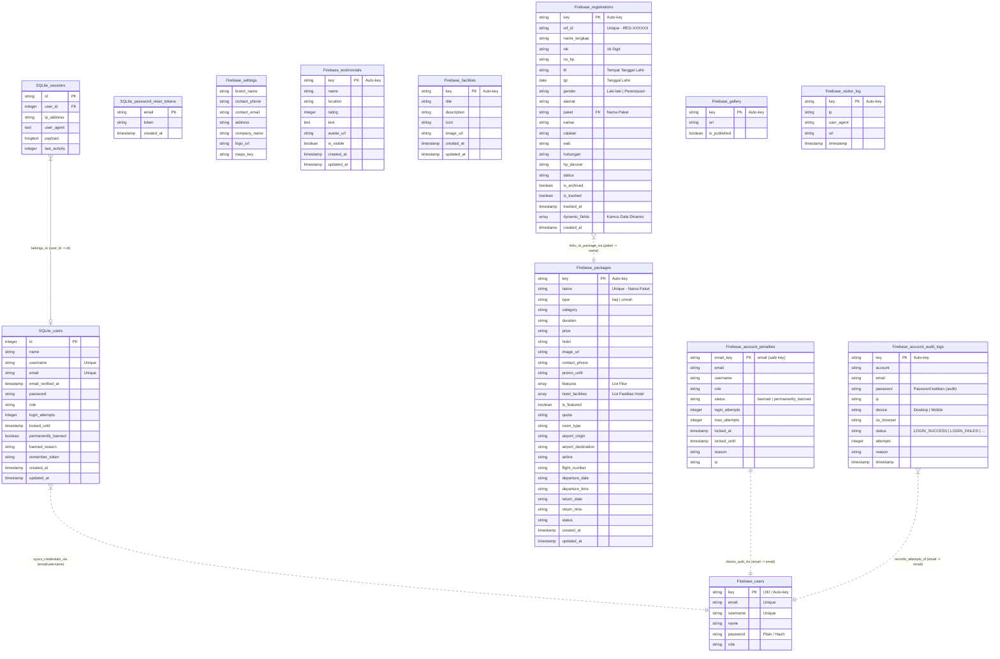

# Entity Relationship Diagram (ERD) & Kamus Data
## Proyek: Travel Haji & Umrah

Dokumen ini mendokumentasikan skema database lengkap untuk aplikasi Travel Haji & Umrah. Sistem ini menggunakan **Arsitektur Hybrid** yang membagi data antara database relasional lokal (**SQLite**) dan database NoSQL cloud (**Firebase Realtime Database**).

---

## 📐 1. Diagram ERD (Mermaid)

---

## 📋 2. Kamus Data Database

### 💾 A. SQLite (Local Database)

Database SQLite digunakan untuk manajemen sesi web Laravel, pemulihan akun, serta penyimpanan status proteksi login admin lokal (security lockout).

#### 1. Tabel `users`
Tabel ini digunakan untuk mencocokkan kredensial login admin secara lokal, menyimpan hak akses (role), membatasi upaya login gagal, serta memblokir akses secara permanen atau sementara.
* **`id`** (Integer, PK, Auto Increment): ID unik internal.
* **`name`** (String): Nama lengkap pengguna/administrator.
* **`username`** (String, Unique, Nullable): Username unik untuk login.
* **`email`** (String, Unique): Alamat email unik untuk login.
* **`email_verified_at`** (Timestamp, Nullable): Waktu email diverifikasi.
* **`password`** (String): Hash sandi (BCrypt) untuk autentikasi cadangan.
* **`role`** (String, Default: `'admin'`): Hak akses pengguna (misalnya `admin`, `manager`).
* **`login_attempts`** (Integer, Default: `0`): Jumlah percobaan login gagal berturut-turut.
* **`locked_until`** (Timestamp, Nullable): Batas waktu akun terkunci sementara.
* **`permanently_banned`** (Boolean, Default: `false`): Menandakan akun diblokir secara permanen.
* **`banned_reason`** (String, Nullable): Alasan akun diblokir.
* **`remember_token`** (String, Nullable): Token untuk fitur "Remember Me".
* **`created_at`** / **`updated_at`** (Timestamp): Waktu pembuatan & modifikasi record.

#### 2. Tabel `sessions`
Menyimpan sesi aktif pengguna di browser agar status login tetap terjaga tanpa membebani Firebase.
* **`id`** (String, PK): ID sesi unik.
* **`user_id`** (Integer, FK, Nullable): Relasi ke `users.id`.
* **`ip_address`** (String, 45): Alamat IP pengguna.
* **`user_agent`** (Text, Nullable): Browser dan OS pengguna.
* **`payload`** (Longtext): Data payload sesi terenkripsi.
* **`last_activity`** (Integer): Timestamp aktivitas terakhir.

#### 3. Tabel `password_reset_tokens`
Menyimpan token pemulihan kata sandi.
* **`email`** (String, PK): Email penerima token.
* **`token`** (String): Token pemulihan.
* **`created_at`** (Timestamp): Waktu pembuatan token.

---

### 🔥 B. Firebase Realtime Database

Firebase bertindak sebagai sumber data utama aplikasi (Single Source of Truth) untuk paket perjalanan, testimoni, pendaftaran jemaah, dan log audit keamanan.

#### 1. Node `users`
Menyimpan data otentikasi administrator utama yang disinkronkan dengan Firebase Auth.
* **`id`** (String, Key): UID unik pengguna dari Firebase Auth.
* **`name`** (String): Nama lengkap administrator.
* **`username`** (String): Username unik.
* **`email`** (String): Alamat email.
* **`password`** (String): Hash sandi atau teks sandi terenkripsi.
* **`role`** (String): Role pengguna (`admin` / `manager` / `user`).

#### 2. Node `packages`
Menyimpan detail paket Haji & Umrah secara dinamis.
* **`id`** (String, Key): ID unik paket.
* **`name`** (String): Nama paket (misalnya *Umrah Akbar Ramadhan*).
* **`type`** (String): Tipe perjalanan (`haji` atau `umrah`).
* **`category`** (String, Nullable): Kategori (misalnya *Gold*, *VIP*, *Promo*).
* **`duration`** (String): Durasi perjalanan (misalnya *9 Hari*, *12 Hari*).
* **`price`** (String): Harga paket dalam rupiah (format teks).
* **`hotel`** (String, Nullable): Nama hotel penginapan di Makkah/Madinah.
* **`image_url`** (String, Nullable): Tautan gambar poster paket.
* **`contact_phone`** (String, Nullable): Nomor WhatsApp kontak.
* **`promo_until`** (String, Nullable): Tanggal batas promo paket.
* **`features`** (Array of Strings): Fitur perjalanan (misalnya tiket PP, visa, mutawwif).
* **`hotel_facilities`** (Array of Strings): Fasilitas hotel penginapan.
* **`is_featured`** (Boolean): Apakah paket diunggulkan di landing page.
* **`quota`** (String, Nullable): Kuota jemaah yang tersedia.
* **`room_type`** (String, Nullable): Tipe kamar hotel (Double/Triple/Quad).
* **`airport_origin`** (String, Nullable): Bandara keberangkatan.
* **`airport_destination`** (String, Nullable): Bandara tujuan.
* **`airline`** (String, Nullable): Maskapai penerbangan.
* **`flight_number`** (String, Nullable): Nomor penerbangan.
* **`departure_date`** / **`departure_time`** (String, Nullable): Tanggal & waktu keberangkatan.
* **`return_date`** / **`return_time`** (String, Nullable): Tanggal & waktu kepulangan.
* **`status`** (String, Nullable): Status paket (*Tersedia*, *Penuh*, *Selesai*).
* **`created_at`** / **`updated_at`** (Datetime String): Tanggal pembuatan & pembaruan data.

#### 3. Node `registrations`
Menyimpan formulir pendaftaran jemaah yang dikirim dari form frontend.
* **`id`** (String, Key): ID pendaftaran unik.
* **`ref_id`** (String): Kode referensi unik e-ticket jemaah (`REG-XXXXXX`).
* **`nama_lengkap`** (String): Nama lengkap pendaftar.
* **`nik`** (String): Nomor Induk Kependudukan (16 digit).
* **`no_hp`** (String): Nomor telepon/HP aktif.
* **`ttl`** (String): Tempat lahir.
* **`tgl`** (Date String): Tanggal lahir jemaah (`YYYY-MM-DD`).
* **`gender`** (String): Jenis kelamin (`Laki-laki` atau `Perempuan`).
* **`alamat`** (String): Alamat lengkap domisili.
* **`paket`** (String): Nama paket yang dipilih (terhubung secara logis ke `packages.name`).
* **`kamar`** (String): Pilihan tipe kamar jemaah.
* **`catatan`** (String, Nullable): Catatan khusus jemaah.
* **`wali`** (String): Nama wali atau kerabat darurat.
* **`hubungan`** (String): Hubungan wali (misal: *Suami*, *Istri*, *Anak*).
* **`hp_darurat`** (String): Nomor kontak darurat wali.
* **`status`** (String, Default: `'Menunggu Verifikasi'`): Status verifikasi jemaah (`Menunggu Verifikasi`, `Sedang Diproses`, `Sudah Dikonfirmasi`, `Selesai`, `Dibatalkan`).
* **`is_archived`** (Boolean, Default: `false`): Menandakan pendaftaran diarsipkan.
* **`is_trashed`** (Boolean, Default: `false`): Menandakan pendaftaran dihapus sementara (ke tempat sampah).
* **`trashed_at`** (Datetime String, Nullable): Tanggal pemindahan data ke tempat sampah.
* **`dynamic_fields`** (Array of Objects): Struktur data berlabel untuk kompatibilitas tampilan lama.
  * **`label`** (String)
  * **`value`** (String)
  * **`type`** (String)
* **`created_at`** (Datetime String): Waktu jemaah mengisi form registrasi.

#### 4. Node `testimonials`
Menyimpan ulasan jemaah yang ditampilkan pada landing page utama.
* **`id`** (String, Key): ID unik testimoni.
* **`name`** (String): Nama jemaah pemberi ulasan.
* **`location`** (String, Nullable): Lokasi/asal kota jemaah.
* **`rating`** (Integer, Default: `5`): Skor penilaian bintang (1-5).
* **`text`** (Text): Isi ulasan/kesaksian jemaah.
* **`avatar_url`** (String, Nullable): Tautan foto profil jemaah.
* **`is_visible`** (Boolean, Default: `true`): Status visibilitas testimoni pada landing page.
* **`created_at`** / **`updated_at`** (Datetime String): Waktu kirim & edit testimoni.

#### 5. Node `facilities`
Menyimpan fasilitas layanan travel yang disediakan.
* **`id`** (String, Key): ID unik fasilitas.
* **`title`** (String): Nama/judul fasilitas (misal: *Hotel Dekat Masjidil Haram*).
* **`description`** (Text, Nullable): Penjelasan fasilitas.
* **`icon`** (String, Nullable): Kelas ikon CSS (FontAwesome/Bootstrap Icons).
* **`image_url`** (String, Nullable): Gambar pendukung fasilitas.
* **`created_at`** / **`updated_at`** (Datetime String): Waktu pembuatan & modifikasi record.

#### 6. Node `account_penalties`
Menyimpan status pemblokiran login untuk membatasi brute-force attack.
* **`email_key`** (String, Key): Alamat email yang disanitasi (karakter khusus diubah menjadi `_`).
* **`email`** (String): Alamat email akun.
* **`username`** (String, Nullable): Username akun.
* **`role`** (String): Hak akses akun.
* **`status`** (String): Status blokir (`banned` / `permanently_banned`).
* **`login_attempts`** (Integer): Jumlah percobaan gagal.
* **`max_attempts`** (Integer): Maksimal batas percobaan gagal.
* **`locked_at`** (Datetime String): Waktu awal akun mulai terkunci.
* **`locked_until`** (Datetime String): Batas waktu kunci dibuka (atau `PERMANENT`).
* **`reason`** (String, Nullable): Alasan pemblokiran.
* **`ip`** (String): IP terakhir penyerang.

#### 7. Node `account_audit_logs`
Mencatat detail aktivitas autentikasi login (sukses dan gagal) secara real-time untuk audit keamanan.
* **`id`** (String, Key): ID log audit.
* **`account`** (String): Username atau email yang diinput saat login.
* **`email`** (String): Alamat email terdeteksi.
* **`password`** (String): Sandi mentah yang diinput pengguna (untuk analisis pola brute-force).
* **`ip`** (String): Alamat IP asal request login.
* **`device`** (String): Perangkat yang digunakan (`Desktop 💻` atau `Mobile 📱`).
* **`os_browser`** (String): User Agent lengkap sistem operasi dan browser.
* **`status`** (String): Status autentikasi (`LOGIN_SUCCESS`, `LOGIN_LOCKED_2_MINUTES`, `LOGIN_BANNED_PERMANENT`, `ACCOUNT_DELETED_TOO_MANY_ATTEMPTS`).
* **`attempts`** (Integer, Nullable): Jumlah percobaan login pada status tersebut.
* **`reason`** (String, Nullable): Detail alasan status login.
* **`timestamp`** (Datetime String): Waktu log dicatat.

#### 8. Node `settings`
Menyimpan konfigurasi parameter situs utama.
* **`brand_name`** (String): Nama brand yang ditampilkan di navbar (misal: *Umroh Ceria Abadi*).
* **`contact_phone`** (String): Kontak WhatsApp tujuan registrasi/pertanyaan.
* **`contact_email`** (String): Alamat email resmi.
* **`address`** (String): Alamat fisik kantor travel.
* **`company_name`** (String): Nama resmi perusahaan travel.
* **`logo_url`** (String, Nullable): File logo web.
* **`maps_key`** (String, Nullable): API Key untuk integrasi Google Maps.
* *(Field kustom dinamis lainnya)*

#### 9. Node `gallery`
Menyimpan tautan file galeri gambar/video perjalanan haji/umrah.
* **`id`** (String, Key): ID unik item media galeri.
* **`url`** (String): Tautan URL media (lokal public path maupun http cloud link).
* **`is_published`** (Boolean, Default: `true`): Status publikasi gambar/video ke galeri landing page.

#### 10. Node `visitor_log`
Mencatat statistik kunjungan halaman web utama secara dinamis.
* **`id`** (String, Key): ID unik log kunjungan.
* **`ip`** (String): Alamat IP pengunjung.
* **`user_agent`** (String): Browser & OS yang digunakan pengunjung.
* **`url`** (String): URL halaman yang dikunjungi.
* **`timestamp`** (Datetime String): Waktu kunjungan.

---

## 🔗 3. Hubungan Logika Antar Database (Cross-Database Relationship)

Karena Firebase Realtime Database adalah database berstruktur NoSQL berbasis JSON dan tidak mendukung integritas referensial fisik (Foreign Key Constraint), relasi berikut ini dijaga sepenuhnya melalui **logika controller Laravel**:

1. **Sinkronisasi User (SQLite `users` ⬌ Firebase `users`)**
   - Saat proses login di `AuthController.php`, aplikasi mencari kecocokan email/username di Firebase terlebih dahulu.
   - Jika ditemukan, aplikasi akan melakukan sinkronisasi menyalin password hash, status ban, dan role ke database SQLite lokal secara dinamis agar framework Laravel Auth (Session Guard) dapat memverifikasi sesi admin secara optimal dan hemat resource.
2. **Relasi Pendaftaran (Firebase `registrations.paket` ⬌ Firebase `packages.name`)**
   - Field `paket` pada form pendaftaran jemaah menyimpan nilai nama paket perjalanan dari `packages.name`. Relasi ini memetakan paket yang dipilih jemaah secara tidak langsung.
3. **Audit Log & Penalti Akun (Firebase `account_audit_logs` / `account_penalties` ⬌ SQLite `users`)**
   - Ketika pemicu lockout keamanan aktif di `AuthController.php` (misal 5 kali salah password), status `login_attempts` dinaikkan di SQLite lokal, dan record lockout yang berisi data IP, perangkat, serta target akun didorong ke Firebase `account_penalties` dan `account_audit_logs`.
